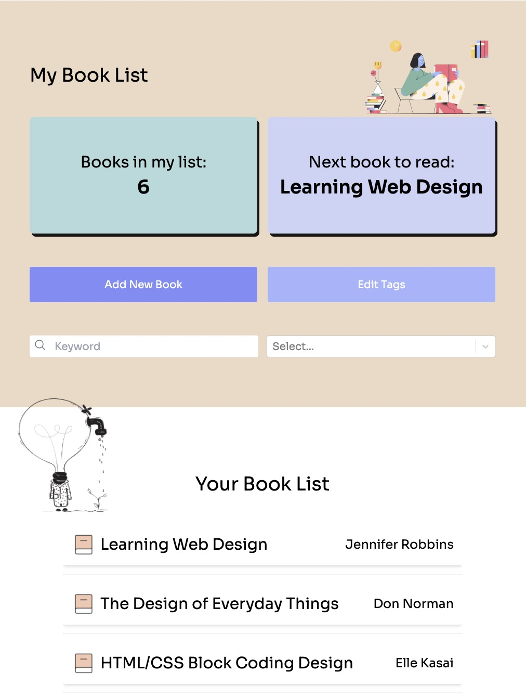

# Book_List

## About this app

I developed the Book_List app to explore and make full use of React Hooks: specifically useContext and useReducer. For an in-depth understanding of these hooks, you can refer to my blogs posts linked below. Additionally, I elevated the project by incorporating TypeScript, enhancing the application's type safety and robustness.

[Understanding React useContext](https://dev.to/ayako_yk/understanding-react-usecontext-2bch) 
[Understanding React useReducer](https://dev.to/ayako_yk/understanding-react-usereducer-1cb2) 
[useContext + useReducer with Sample Code](https://dev.to/ayako_yk/usecontext-usereducer-with-sample-code-45e3)

## Technologies used

- TypeScript
- Vite
- Tailwind CSS

## Libraries used

- react-select (version 5.8.0)

## Page Overview

 
 
 

**Home** 
The Home page presents the user's book list, displayed at the bottom. A card at the top showcases the total number of books in the list. Additionally, a recommended book, which is the first in the list, is featured at the top. The integration of useContext and useReducer enhances state management. 

**Add/Edit** 
This section empowers users to create new books or edit existing ones. When editing, the form displays the existing data for seamless modification. 

**Show** 
In this section, users gain access to detailed information about a specific book from their list. 

**Edit Tags** 
The Edit Tags page leverages the power of react-select to simplify the selection, creation, editing, and deletion of tags. This library provides an intuitive interface for managing multiple tags associated with books. 

## License

Images - [absurd illustrations that make sense](https://absurd.design/) 
Images - [icons8](https://icons8.com/illustrations)
